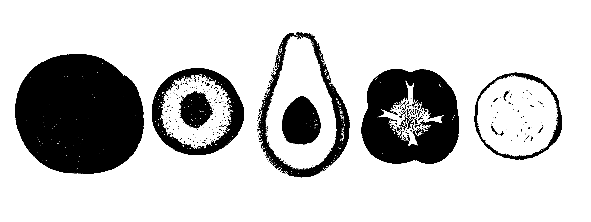
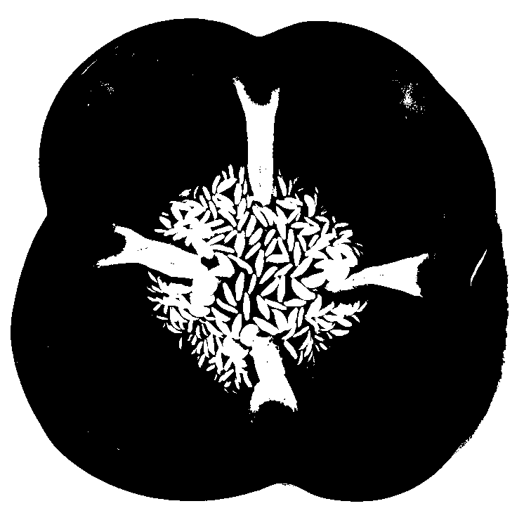
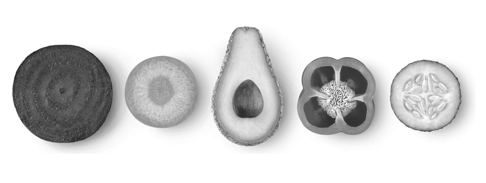
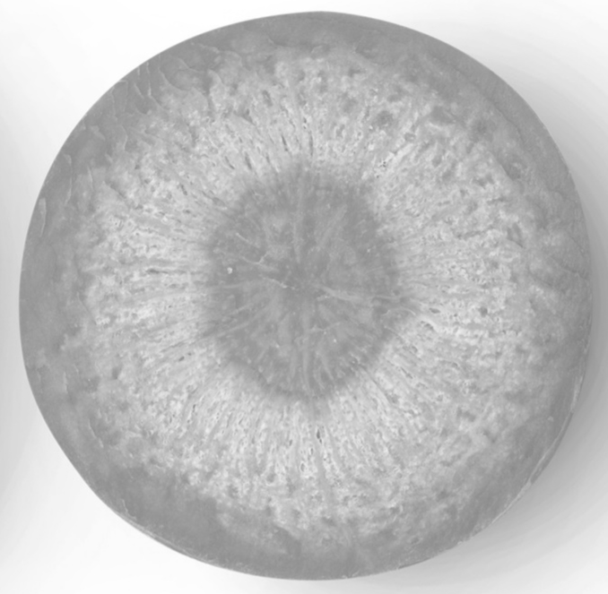
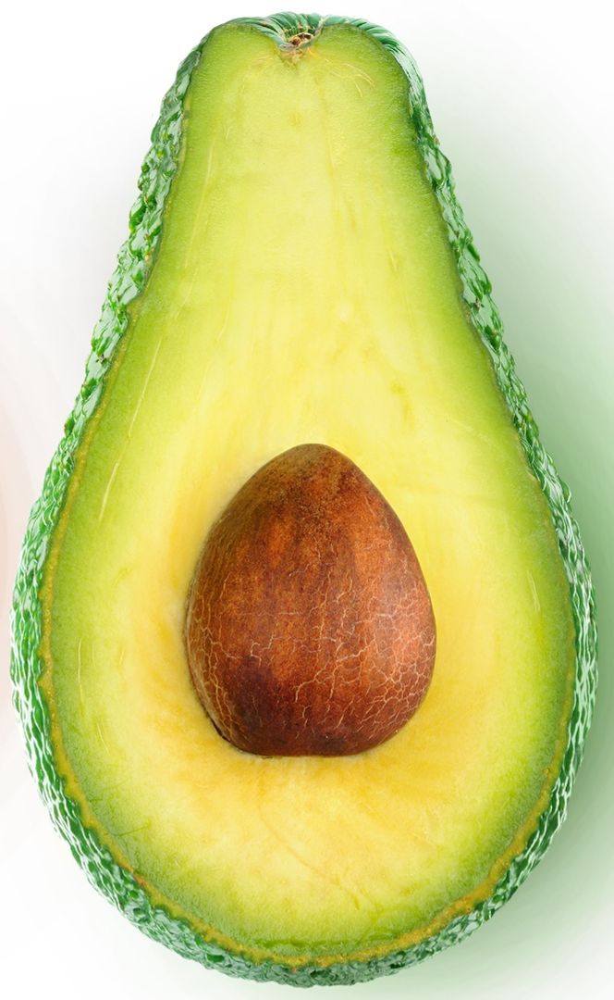
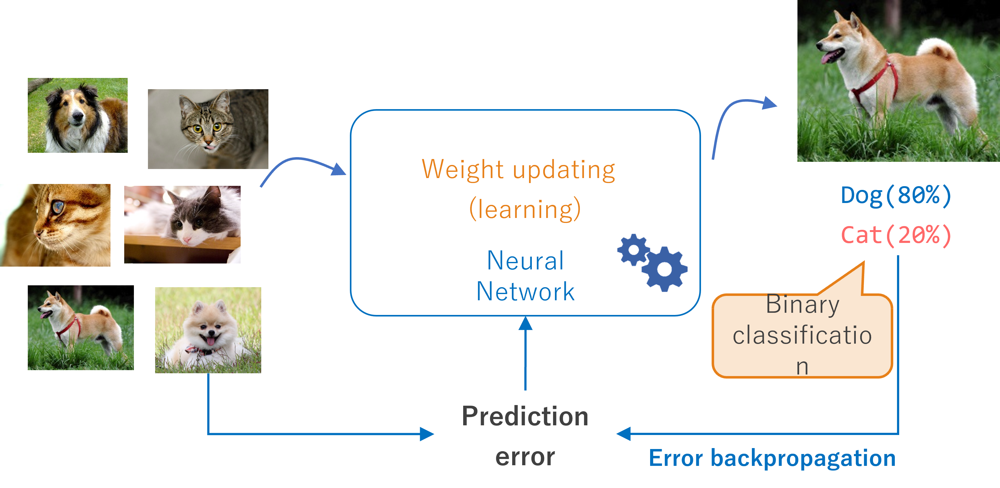

# OpenCV2 パターンマッチング

前回紹介した SAD はわかりやすいが、外乱（ノイズ）に弱い。より良い方法がさまざま研究・開発されている。
今回紹介する方法は AI (人工知能) ではなく、あくまで計算 (数学) で「もっとも近しい」ところを見つけ出している。

これらは colaboratory でも試すことができる。

# サンプル画像

## ２値画像

白と黒の点で作られた画像。

### マッチング対象


### マッチングパターン


### サンプルプログラム

``` python
import cv2

# ファイルを読み込む
img = cv2.imread("sample_vegi_2.png")
template = cv2.imread('sample_vegi_2_pat.png')
(h, w, c) = template.shape

# マッチング処理
res = cv2.matchTemplate(img, template, cv2.TM_CCORR_NORMED)
(min_val, max_val, min_loc, max_loc) = cv2.minMaxLoc(res)

# 四角で囲う
top_left = max_loc
bottom_right = (top_left[0] + w, top_left[1] + h)
cv2.rectangle(img, top_left, bottom_right, (0,0,255), 2)

# ファイルに書き出す
cv2.imwrite("result_2.png", img)
```

## グレースケール

真っ白 (255) から真っ黒 (0) まで 256 段階で色分けした画像。

### マッチング対象


### マッチングパターン


### サンプルプログラム

``` python
import cv2

# ファイルを読み込む
img = cv2.imread("sample_vegi_gray.png")
template = cv2.imread('sample_vegi_gray_pat.png')
(h, w, c) = template.shape

# マッチング処理
res = cv2.matchTemplate(img, template, cv2.TM_CCORR_NORMED)
(min_val, max_val, min_loc, max_loc) = cv2.minMaxLoc(res)

# 四角で囲う
top_left = max_loc
bottom_right = (top_left[0] + w, top_left[1] + h)
cv2.rectangle(img, top_left, bottom_right, (0,0,255), 2)

# ファイルに書き出す
cv2.imwrite("result_2.png", img)
```
## カラー画像

### マッチング対象


### マッチングパターン


### サンプルプログラム

```
自分で書いてみよう
```

# 正規化相関係数 (TM_CCOEFF_NORMED)

もっとも頑健 (がんけん。丈夫、頑丈。ノイズに強い)。ただし計算がめんどくさい (コンピュータに負荷になる)。コンピュータが速いときにはこいつを使えばいい。
1 が最も似ている。0 が無相関。-1 は正反対。  
「ピアソンの相関係数」という値。

# 相関係数 (TM_CCOFF)

正規化相関係数は -1 ~ +1 の間に収まるようになっているが、それの計算を省いた。つまり相関値の範囲は画像次第。

# 正規化二乗差 (TM_SQDIFF_NORMED)

SAD は単純に引いたものの絶対値を足していたが、SQDIFF は引いたものを２乗して足し込む。ずれればずれるほど、差が広がる。
「正規化」は 0~1の範囲に収まるようにしたよ、という意味。
処理が簡単なので、コンピュータの負荷が軽い。ただし精度とのトレードオフ。

# 二乗差 (TM_SQDIFF)
引いたものの２乗して足し込む。
処理が簡単なので、コンピュータの負荷が軽い。ただし精度とのトレードオフ。

# 相互相関 (TM_CCORR)
画像を行列と見立て、内積 (掛け算) を求めたもの。傾向が似ていれば大きくなる。
(工業数学でやったけど覚えてる？)

# 正規化相互相関 (TM_CORR_NORMED)
上の相互相関を -1 ~ 1 の範囲に収まるようにしたもの。


```NORMED``` は normalized (正規化) の省略形。

# ラズパイ公式カメラ Ver.3 の対応

ラズパイ公式カメラ Ver.3 (Camera Module 3) は OpenCV の ```cap.read()``` メソッドからは読み取れないことがわかった。
別の方法として ```Picamera2``` というモジュールを使うと画像取得ができることがわかったので、Camera Module 3 を利用する人は、```Picamera2```
を利用すること。

## Camera Ver.2 用サンプル

```python
import cv2

cap = cv2.VideoCapture(0)      # Raspberry Piカメラのキャプチャを開始
# キャプチャが正常に開始されたかどうかを確認
if not cap.isOpened():
    print("カメラを開けませんでした。")
    exit()

while True:
    # フレームを1つずつ読み込む
    ret, frame = cap.read()

    # イメージの読み取り
    if not ret:
        print("フレームを読み込めませんでした。")
        break
    cv2.imshow('Raspberry Pi Camera', frame)

    # Escキーを入力されたら画面を閉じる
    key = cv2.waitKey(1)
    if key == 27:
        break

cap.release()
cv2.destroyAllWindows()
```

## Camera Ver.3 用サンプル

800x600 (WVGA) だと処理が重いかもしれない。6 行目の ```size``` を 640x480(VGA), 320x240(QVGA) に設定すると処理が軽くなる。

```python
import cv2                      # OpenCV を使う
from picamera2 import Picamera2 # Picamera2 を使う
from libcamera import controls  # カメラの制御パラメーター

camera = Picamera2()
camera.configure(camera.create_preview_configuration(main={"format": 'XRGB8888', "size": (800, 600)}))

# カメラを有効化
camera.start()
#カメラを連続オートフォーカスモードにする
camera.set_controls({"AfMode": controls.AfModeEnum.Continuous})

while True:
    # イメージの読み取り
    im = camera.capture_array()   
    cv2.imshow("Camera", im)
  
    # Escキーを入力されたら画面を閉じる
    key = cv2.waitKey(1)
    if key == 27:
      break

# 終了処理
camera.stop()
cv2.destroyAllWindows()
```

# 顔認識

Ver.3 カメラで顔認識をしてみよう。Ver.2 でもカメラの読み取り方法を変更すれば可能。  
(AI を使った) 認識は顔の特徴点 (目の位置、鼻の位置、口の位置) などから顔認識をしている。  
OpenCV には **学習済みモデル** (顔の特徴を学習した状態の AI) が用意されていて、それを呼び出すことで顔認識ができる。  
猫の学習済みモデルもある。



```python
import cv2

from picamera2 import Picamera2

## ~.xml は設定ファイル。環境によって OpenCV をどこにインストールしたかで変化する。
## find /home /usr | grep frontalface と実行すると場所がわかる。
## 以下は、先生のラズパイの状態。
face_detector = cv2.CascadeClassifier("/home/takaya/.local/lib/python3.9/site-packages/cv2/data/haarcascade_frontalface_default.xml")

picam2 = Picamera2()
picam2.configure(picam2.create_preview_configuration(main={"format": 'XRGB8888', "size": (640, 480)}))

picam2.start()

while True:
    im = picam2.capture_array()

    # カラー画像からグレー画像に変換
    grey = cv2.cvtColor(im, cv2.COLOR_BGR2GRAY)

    # 顔認識
    faces = face_detector.detectMultiScale(grey, 1.1, 5)

    # 見つけた位置を緑で囲う
    for (x, y, w, h) in faces:
        cv2.rectangle(im, (x, y), (x + w, y + h), (0, 255, 0))

    cv2.imshow("Camera", im)
    key = cv2.waitKey(1)
    if key == 27:
        break
```